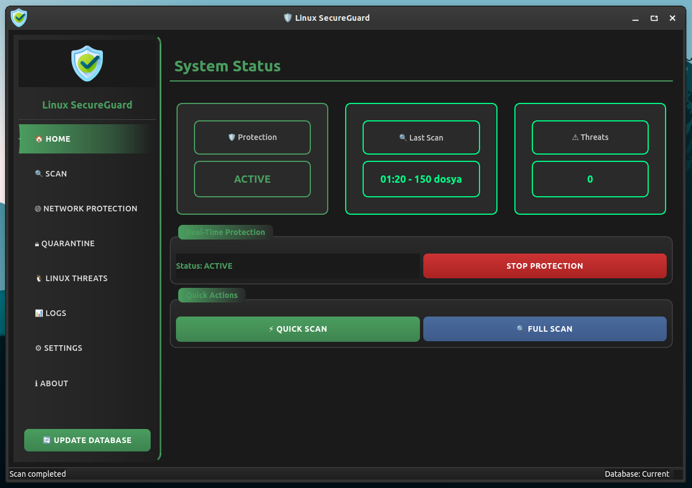
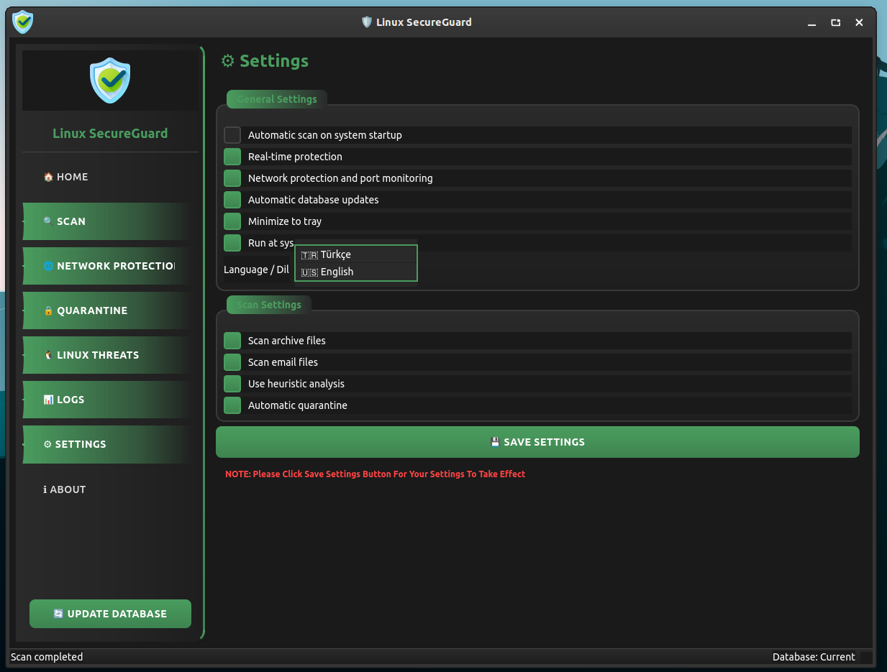

## [Türkçe Kılavuz](https://github.com/cektor/LSG/blob/main/README_TR.md)

<a href="#">
    
</a>

<div align="center">

<h1 align="center"></h1>

<p align="center">
  
</p>


# 🛡️ Linux SecureGuard

Professional antivirus solution developed for Linux systems. Protects your Linux servers and desktop systems with real-time protection, network security and advanced threat detection features.


## ✨ Features

### 🛡️ Security Features
- **Real-time protection** - System is continuously monitored and threats are detected instantly
- **Linux-specific malware detection** - Mirai, Gafgyt, rootkits and Linux botnets
- **Network security and port monitoring** - Detects suspicious connections and port scans
- **Automatic quarantine system** - Dangerous files are safely isolated
- **Heuristic analysis** - Detects suspicious scripts and executables
- **Whitelist management** - Exception list for trusted files

### 🔍 Scan Options
- **Quick Scan** - Critical system locations and user directories
- **Full System Scan** - Comprehensive scan of entire file system
- **Custom Folder Scan** - Targeted scanning of specific directories
- **Archive file support** - Scanning in ZIP, TAR, GZ formats

### 🌐 Network Protection
- **Port monitoring** - Controls open ports and services
- **Suspicious connection detection** - Connections from unknown IPs
- **Trusted IP/Port list** - Exception management
- **Automatic IP blocking** - Blocks dangerous IPs with iptables

### 🎨 User Interface
- **Modern dark theme** - Eye-friendly design
- **Multi-language support** - Turkish and English
- **System tray integration** - Background operation
- **Real-time notifications** - Instant alerts on threat detection
- **Detailed reporting** - Comprehensive scan results

## 📋 System Requirements

- **Operating System**: Linux (Ubuntu, Debian, CentOS, Fedora)
- **Python**: 3.8 or higher
- **RAM**: Minimum 512 MB
- **Disk Space**: 100 MB free space
- **Network**: Internet connection (for database updates)

## 🚀 Installation

# To install directly on Linux


Linux (based debian) Terminal: Linux (debian based distributions) To install directly from Terminal.
```bash
wget -O Setup_Linux64.deb https://github.com/cektor/LSG/releases/download/1.0.0/Setup_Linux64.deb && sudo apt install ./Setup_Linux64.deb && sudo apt-get install -f -y
```


### Prerequisites
```bash
# For Ubuntu/Debian
sudo apt update
sudo apt install python3 python3-pip python3-venv git

# For CentOS/RHEL/Fedora
sudo dnf install python3 python3-pip git
# or
sudo yum install python3 python3-pip git
```

### Build from Source
```bash
# 1. Clone the repository
git clone https://github.com/cektor/lsg.git
cd lsg

# 2. Create virtual environment (recommended)
python3 -m venv venv
source venv/bin/activate

# 3. Install dependencies
pip install -r requirements.txt

# 4. Run the application
python3 lsg.py
```

### System-wide Installation (Optional)
```bash
# Copy executable to system path
sudo cp lsg.py /usr/local/bin/lsg
sudo chmod +x /usr/local/bin/lsg

# Copy desktop file
sudo cp linux-secureguard.desktop /usr/share/applications/

# Copy icons
sudo cp *.png /usr/share/pixmaps/

# Now you can run with 'lsg' command
lsg
```


## 📸 Screenshots

<div align="center">








</div>


## 🎯 Usage

### Quick Start
1. **Home Page**: View system status
2. **Protection**: Start/stop real-time protection
3. **Scan**: Quick, full or custom scan options
4. **Quarantine**: Manage detected threats

### Scan Types
- **⚡ Quick Scan**: Home folder and critical system files (~5-10 minutes)
- **🔍 Full Scan**: All system files (~30-60 minutes)
- **📁 Custom Scan**: Selected folder and subfolders

### Quarantine Management
- Dangerous files are automatically quarantined
- You can restore files or permanently delete them from quarantine panel
- Whitelist support for false positive files

### Network Protection
- Real-time port monitoring
- Suspicious connection detection
- Trusted IP/Port list management
- Automatic threat blocking

## 🔧 Configuration

### Settings Panel
- **Real-time protection**: Continuous system monitoring
- **Network protection**: Port and connection monitoring
- **Automatic updates**: Virus database updates
- **System startup**: Automatic startup
- **Language selection**: Turkish/English

### Command Line Options
```bash
# Normal startup
lsg

# Run from system startup
lsg --startup

# Scan-only mode
lsg --scan-only

# Help
lsg --help
```

## 🛠️ Technical Details

### Linux Malware Detection Method
- **MD5 Hash Check**: Known Linux malware hashes
- **Signature-based Detection**: Mirai, Gafgyt, XorDDoS, rootkits
- **Heuristic Analysis**: Suspicious shell scripts and executable files
- **Location Analysis**: Suspicious locations like `/tmp/`, `/var/tmp/`, `/dev/shm/`
- **Permission Check**: Hidden files with executable permissions

### Database Structure
- **SQLite**: Local virus signature database
- **Automatic updates**: ClamAV database integration
- **Hash-based**: MD5 hash comparison
- **Categorization**: Botnet, rootkit, miner, backdoor

### Security Features
- **Quarantine**: Safe file isolation
- **Whitelist**: Trusted file management
- **Activity logs**: Record of all operations
- **Minimal system intervention**: Low resource usage

## 📊 Performance

### System Resources
- **RAM Usage**: ~50-100 MB
- **CPU Usage**: 1-5% (idle state)
- **Disk I/O**: Minimal (only during scanning)

### Scan Speeds
- **Quick Scan**: ~500 files/minute
- **Full Scan**: ~200 files/minute
- **Network Monitoring**: 10-second intervals

## 🔍 Supported Threats

### Linux Malware Types
- **Botnet**: Mirai, Gafgyt, XorDDoS
- **Rootkit**: Adore, Knark, Suckit
- **Miner**: XMRig, CoinMiner, Malxmr
- **Backdoor**: Setag, Tsunami
- **Trojan**: Linux.Trojan.*

### Suspicious File Locations
- `/tmp/` - Temporary files
- `/var/tmp/` - System temporary files
- `/dev/shm/` - Shared memory
- Hidden executable files

## 🚨 Security Tips

### Linux Security Recommendations
- Perform system updates regularly
- Do not download files from untrusted sources
- Keep your SSH keys secure
- Check your firewall rules
- Use strong passwords
- Disable unnecessary services

## 🐛 Troubleshooting

### Common Issues
```bash
# Permission error
sudo chmod +x lsg.py

# Missing library
pip install --upgrade -r requirements.txt

# Database could not be updated
sudo freshclam

# Tray icon not visible
sudo apt install python3-pyqt6
```

### Log Files
- **Activity Logs**: `~/.config/LSG/user_activity.json`
- **Settings**: `~/.config/LSG/antivirus_settings.json`
- **Quarantine**: `~/.config/LSG/quarantine/`

## 🤝 Contributing

1. Fork the project
2. Create feature branch (`git checkout -b feature/new-feature`)
3. Commit your changes (`git commit -am 'Added new feature'`)
4. Push your branch (`git push origin feature/new-feature`)
5. Create Pull Request

## 📄 License

This project is developed by ALG Software & Electronics Inc.

- ✅ **Copying and distribution is free**
- ❌ **Modification of the software is prohibited**
- 📧 **Technical support**: info@algyazilim.com

## 👨💻 Developer

**Fatih ÖNDER (CekToR)**
- 🏢 **Company**: ALG Software & Electronics Inc.
- 🌐 **Website**: https://algyazilim.com
- 📧 **Email**: info@algyazilim.com

## 📞 Support

### Technical Support
- **Email**: info@algyazilim.com
- **Website**: https://algyazilim.com
- **Documentation**: GitHub Wiki

### Community
- GitHub Issues: Bug reports and feature requests
- Discussions: General questions and discussions

---

**⚠️ Important Warning**: Test in a test environment before using on critical systems.

**🛡️ Linux SecureGuard** - *Keep your Linux systems secure!*
