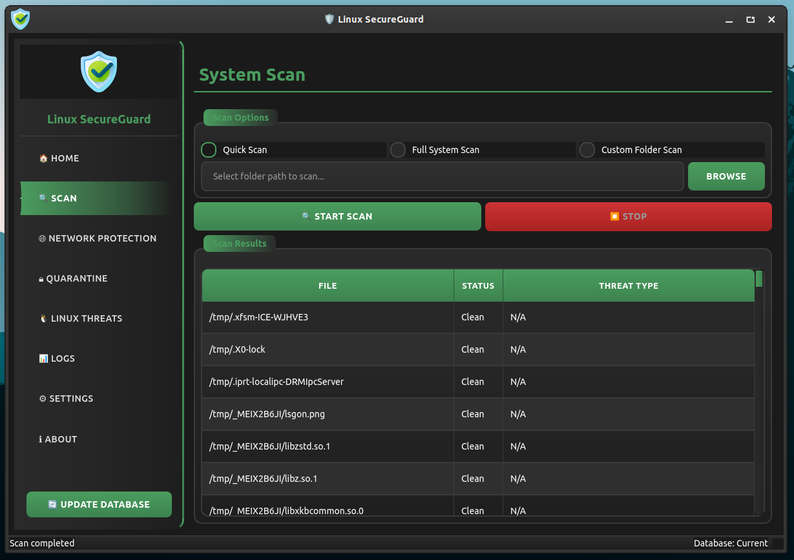
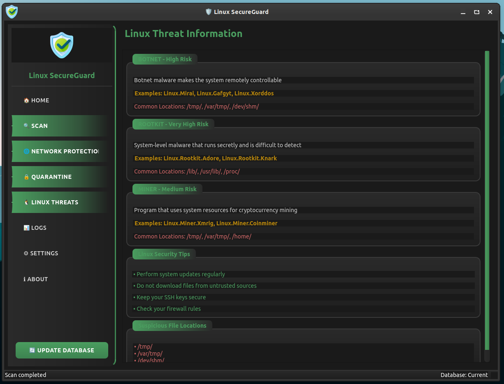
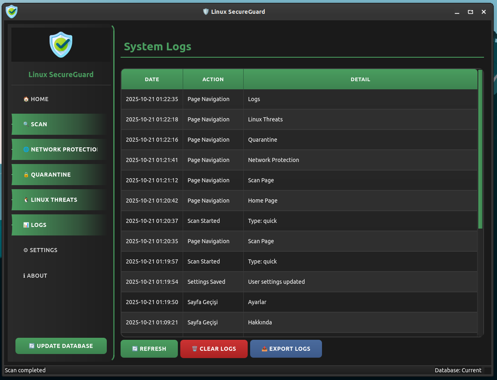
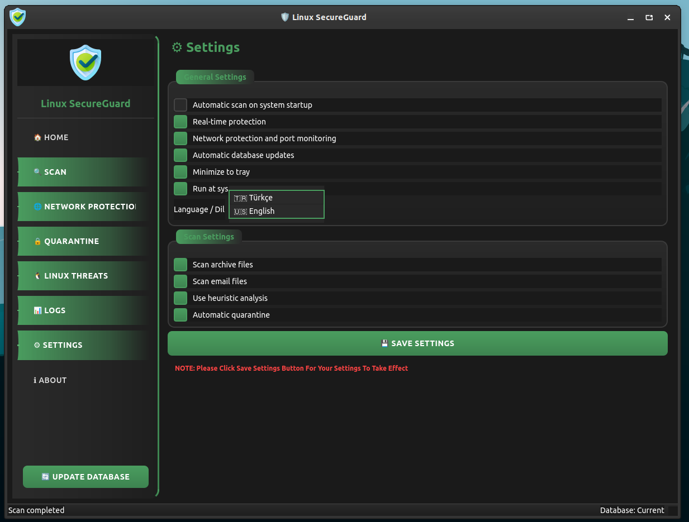
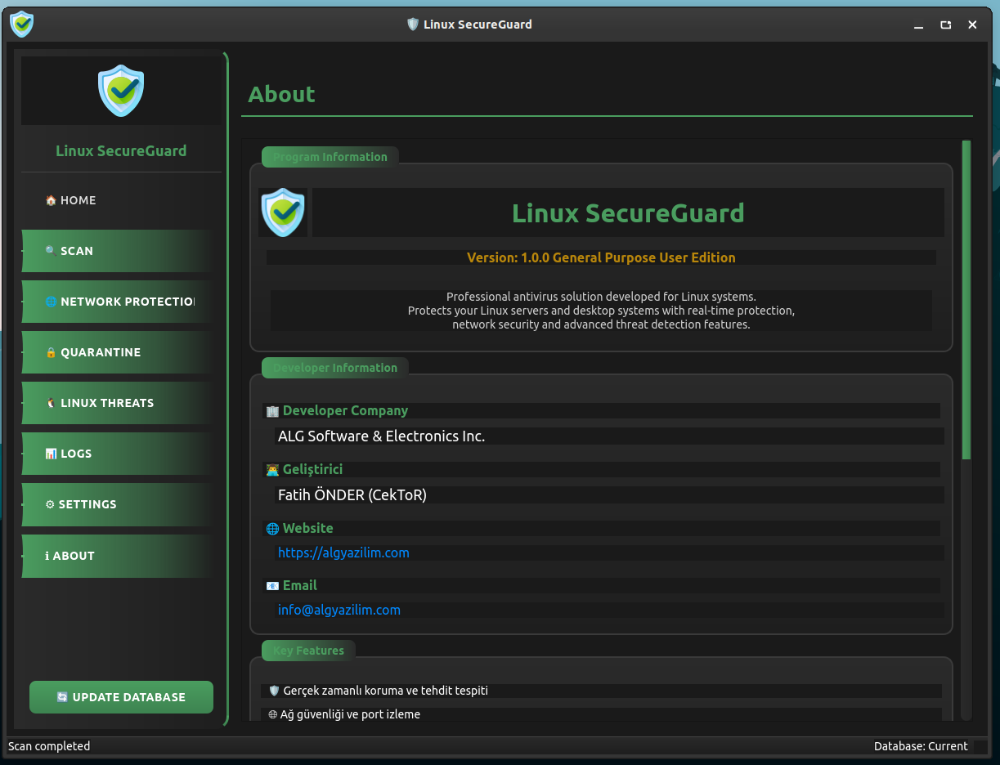

<a href="#">
    
</a>

<div align="center">

<h1 align="center"></h1>

<p align="center">
  
</p>

## [English Guide](https://github.com/cektor/LSG/blob/main/README.md)

# 🛡️ Linux SecureGuard

Linux sistemler için geliştirilmiş profesyonel antivirüs çözümü. Gerçek zamanlı koruma, ağ güvenliği ve gelişmiş tehdit tespiti özellikleri ile Linux sunucularınızı ve masaüstü sistemlerinizi korur.

## ✨ Özellikler

### 🛡️ Güvenlik Özellikleri
- **Gerçek zamanlı koruma** - Sistem sürekli izlenir ve tehditler anında tespit edilir
- **Linux'a özgü malware tespiti** - Mirai, Gafgyt, rootkit'ler ve Linux botnet'leri
- **Ağ güvenliği ve port izleme** - Şüpheli bağlantıları ve port taramalarını tespit eder
- **Otomatik karantina sistemi** - Tehlikeli dosyalar güvenli şekilde izole edilir
- **Sezgisel analiz** - Şüpheli script'ler ve executable'ları tespit eder
- **Beyaz liste yönetimi** - Güvenilir dosyalar için istisna listesi

### 🔍 Tarama Seçenekleri
- **Hızlı Tarama** - Kritik sistem konumları ve kullanıcı dizinleri
- **Tam Sistem Taraması** - Tüm dosya sistemi kapsamlı tarama
- **Özel Klasör Taraması** - Belirli dizinleri hedefleyen tarama
- **Arşiv dosya desteği** - ZIP, TAR, GZ formatlarında tarama

### 🌐 Ağ Koruması
- **Port izleme** - Açık portları ve servisleri kontrol eder
- **Şüpheli bağlantı tespiti** - Bilinmeyen IP'lerden gelen bağlantılar
- **Güvenilir IP/Port listesi** - İstisna yönetimi
- **Otomatik IP engelleme** - Tehlikeli IP'leri iptables ile engeller

### 🎨 Kullanıcı Arayüzü
- **Modern karanlık tema** - Göz yormayan tasarım
- **Çok dilli destek** - Türkçe ve İngilizce
- **Sistem tray entegrasyonu** - Arka planda çalışma
- **Gerçek zamanlı bildirimler** - Tehdit tespitinde anında uyarı
- **Detaylı raporlama** - Kapsamlı tarama sonuçları

## 📋 Sistem Gereksinimleri

- **İşletim Sistemi**: Linux (Ubuntu, Debian, CentOS, Fedora)
- **Python**: 3.8 veya üzeri
- **RAM**: Minimum 512 MB
- **Disk Alanı**: 100 MB boş alan
- **Ağ**: İnternet bağlantısı (veritabanı güncellemeleri için)

## 🚀 Kurulum

# Linux'a doğrudan yüklemek için


Linux (debian tabanlı) Terminal: Linux (debian tabanlı dağıtımlar) Terminal'den doğrudan yüklemek için.
```bash
wget -O Setup_Linux64.deb https://github.com/cektor/LSG/releases/download/1.0.0/Setup_Linux64.deb && sudo apt install ./Setup_Linux64.deb && sudo apt-get install -f -y
```

### Gereksinimler
```bash
# Ubuntu/Debian için
sudo apt update
sudo apt install python3 python3-pip python3-venv git

# CentOS/RHEL/Fedora için
sudo dnf install python3 python3-pip git
# veya
sudo yum install python3 python3-pip git
```

### Kaynak Koddan Kurulum
```bash
# 1. Depoyu klonlayın
git clone https://github.com/cektor/lsg.git
cd lsg

# 2. Sanal ortam oluşturun (önerilen)
python3 -m venv venv
source venv/bin/activate

# 3. Bağımlılıkları yükleyin
pip install -r requirements.txt

# 4. Uygulamayı çalıştırın
python3 lsg.py
```

### Sistem Geneli Kurulum (İsteğe Bağlı)
```bash
# Çalıştırılabilir dosyayı sistem yoluna kopyalayın
sudo cp lsg.py /usr/local/bin/lsg
sudo chmod +x /usr/local/bin/lsg

# Desktop dosyasını kopyalayın
sudo cp linux-secureguard.desktop /usr/share/applications/

# İkonları kopyalayın
sudo cp *.png /usr/share/pixmaps/

# Artık 'lsg' komutuyla çalıştırabilirsiniz
lsg
```

## 📸 Ekran görüntüleri

<div align="center">














</div>


## 🎯 Kullanım

### Hızlı Başlangıç
1. **Ana Sayfa**: Sistem durumunu görüntüleyin
2. **Koruma**: Gerçek zamanlı korumayı başlatın/durdurun
3. **Tarama**: Hızlı, tam veya özel tarama seçenekleri
4. **Karantina**: Tespit edilen tehditleri yönetin

### Tarama Türleri
- **⚡ Hızlı Tarama**: Ev klasörü ve kritik sistem dosyaları (~5-10 dakika)
- **🔍 Tam Tarama**: Tüm sistem dosyaları (~30-60 dakika)
- **📁 Özel Tarama**: Seçtiğiniz klasör ve alt klasörler

### Karantina Yönetimi
- Tehlikeli dosyalar otomatik olarak karantinaya alınır
- Karantina panelinden dosyaları geri yükleyebilir veya kalıcı olarak silebilirsiniz
- Yanlış pozitif dosyalar için beyaz liste desteği

### Ağ Koruması
- Gerçek zamanlı port izleme
- Şüpheli bağlantı tespiti
- Güvenilir IP/Port listesi yönetimi
- Otomatik tehdit engelleme

## 🔧 Yapılandırma

### Ayarlar Paneli
- **Gerçek zamanlı koruma**: Sürekli sistem izleme
- **Ağ koruması**: Port ve bağlantı izleme
- **Otomatik güncellemeler**: Virüs veritabanı güncellemeleri
- **Sistem başlangıcı**: Otomatik başlatma
- **Dil seçimi**: Türkçe/İngilizce

### Komut Satırı Seçenekleri
```bash
# Normal başlatma
lsg

# Sistem başlangıcından çalıştırma
lsg --startup

# Sadece tarama modu
lsg --scan-only

# Yardım
lsg --help
```

## 🛠️ Teknik Detaylar

### Linux Malware Tespit Yöntemi
- **MD5 Hash Kontrolü**: Bilinen Linux malware hash'leri
- **İmza Tabanlı Tespit**: Mirai, Gafgyt, XorDDoS, rootkit'ler
- **Sezgisel Analiz**: Şüpheli shell script'leri ve executable dosyaları
- **Konum Analizi**: `/tmp/`, `/var/tmp/`, `/dev/shm/` gibi şüpheli konumlar
- **İzin Kontrolü**: Executable izinleri olan gizli dosyalar

### Veritabanı Yapısı
- **SQLite**: Yerel virüs imza veritabanı
- **Otomatik güncelleme**: ClamAV veritabanı entegrasyonu
- **Hash tabanlı**: MD5 hash karşılaştırması
- **Kategorizasyon**: Botnet, rootkit, miner, backdoor

### Güvenlik Özellikleri
- **Karantina**: Güvenli dosya izolasyonu
- **Beyaz liste**: Güvenilir dosya yönetimi
- **Aktivite günlükleri**: Tüm işlemlerin kaydı
- **Minimum sistem müdahalesi**: Düşük kaynak kullanımı

## 📊 Performans

### Sistem Kaynakları
- **RAM Kullanımı**: ~50-100 MB
- **CPU Kullanımı**: %1-5 (idle durumda)
- **Disk I/O**: Minimal (sadece tarama sırasında)

### Tarama Hızları
- **Hızlı Tarama**: ~500 dosya/dakika
- **Tam Tarama**: ~200 dosya/dakika
- **Ağ İzleme**: 10 saniye aralıklarla

## 🔍 Desteklenen Tehditler

### Linux Malware Türleri
- **Botnet**: Mirai, Gafgyt, XorDDoS
- **Rootkit**: Adore, Knark, Suckit
- **Miner**: XMRig, CoinMiner, Malxmr
- **Backdoor**: Setag, Tsunami
- **Trojan**: Linux.Trojan.*

### Şüpheli Dosya Konumları
- `/tmp/` - Geçici dosyalar
- `/var/tmp/` - Sistem geçici dosyaları
- `/dev/shm/` - Paylaşılan bellek
- Gizli executable dosyalar

## 🚨 Güvenlik İpuçları

### Linux Güvenlik Önerileri
- Sistem güncellemelerini düzenli olarak yapın
- Güvenilmeyen kaynaklardan dosya indirmeyin
- SSH anahtarlarınızı güvenli tutun
- Firewall kurallarınızı kontrol edin
- Güçlü parolalar kullanın
- Gereksiz servisleri kapatın

## 🐛 Sorun Giderme

### Yaygın Sorunlar
```bash
# İzin hatası
sudo chmod +x lsg.py

# Kütüphane eksik
pip install --upgrade -r requirements.txt

# Veritabanı güncellenemedi
sudo freshclam

# Tray icon görünmüyor
sudo apt install python3-pyqt6
```

### Log Dosyaları
- **Aktivite Logları**: `~/.config/LSG/user_activity.json`
- **Ayarlar**: `~/.config/LSG/antivirus_settings.json`
- **Karantina**: `~/.config/LSG/quarantine/`

## 🤝 Katkıda Bulunma

1. Projeyi fork edin
2. Feature branch oluşturun (`git checkout -b feature/yeni-ozellik`)
3. Değişikliklerinizi commit edin (`git commit -am 'Yeni özellik eklendi'`)
4. Branch'inizi push edin (`git push origin feature/yeni-ozellik`)
5. Pull Request oluşturun

## 📄 Lisans

Bu proje ALG Yazılım & Elektronik Inc. tarafından geliştirilmiştir.

- ✅ **Kopyalama ve dağıtım serbesttir**
- ❌ **Yazılımın değiştirilmesi yasaktır**
- 📧 **Teknik destek**: info@algyazilim.com

## 👨‍💻 Geliştirici

**Fatih ÖNDER (CekToR)**
- 🏢 **Şirket**: ALG Yazılım & Elektronik Inc.
- 🌐 **Website**: https://algyazilim.com
- 📧 **E-posta**: info@algyazilim.com

## 📞 Destek

### Teknik Destek
- **E-posta**: info@algyazilim.com
- **Website**: https://algyazilim.com
- **Dokümantasyon**: GitHub Wiki

### Topluluk
- GitHub Issues: Hata raporları ve özellik istekleri
- Discussions: Genel sorular ve tartışmalar

---

**⚠️ Önemli Uyarı**: Kritik sistemlerde kullanmadan önce test ortamında deneyiniz.

**🛡️ Linux SecureGuard** - *Linux sistemlerinizi güvende tutun!*
